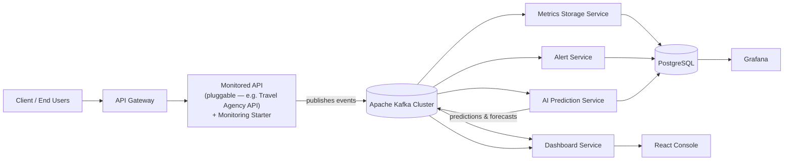
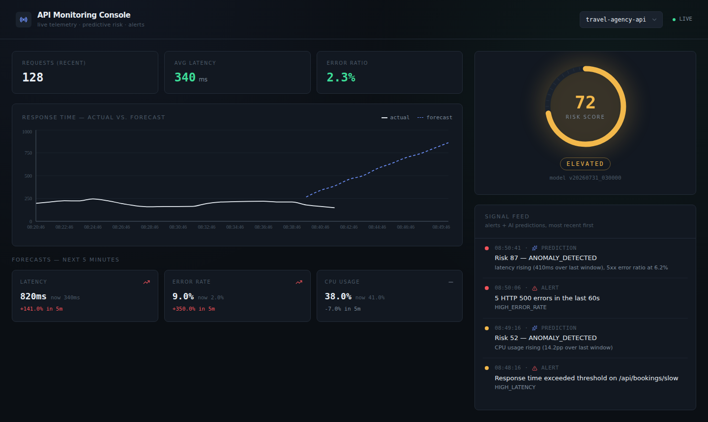

# API Monitoring Platform

A real-time API monitoring platform built with **Spring Boot**, **Apache Kafka**, **PostgreSQL**, and **Grafana** — extended with a **Python/scikit-learn** AI service for predictive health monitoring, and a **React** console for live visualization and notifications.

The platform is designed so the monitored API is **pluggable**: any Spring Boot service can be instrumented by adding one dependency (`monitoring-starter`), without writing any Kafka code itself. Everything downstream — storage, alerting, dashboards, and AI predictions — only ever talks to Kafka topics, never to the monitored API directly.

> Built as part of an internship project. Full design rationale and implementation history are documented in `docs/` and in the accompanying internship report.

---

## What it does

- **Collects** API metrics in real time — response time, HTTP status codes, request counts, CPU/memory usage, and error logs — from any Spring Boot API with zero custom instrumentation code.
- **Streams** every metric through Apache Kafka, decoupling producers from every consumer.
- **Stores** everything durably in PostgreSQL for historical querying.
- **Alerts** reactively when latency exceeds a threshold or error rates spike (Alert Service).
- **Predicts** proactively:
  - an unsupervised/supervised classification model flags API health degradation before it becomes critical,
  - regression models forecast future latency, error rate, and CPU usage a few minutes ahead.
- **Visualizes** live and historical data through Grafana dashboards and a custom React console with real-time WebSocket notifications.

---

## Architecture



Every consumer (storage, alerting, dashboard, AI) is an independent Kafka consumer group. None of them talk to each other directly, and none of them depend on the monitored API's implementation — swapping the monitored API is a one-line config change in the Gateway.

---

## Tech stack

| Layer | Technology |
|---|---|
| Monitored/backend services | Java 21, Spring Boot 3 |
| Messaging | Apache Kafka 3.7 (KRaft mode, no ZooKeeper) |
| Database | PostgreSQL 16 |
| Visualization | Grafana |
| AI / Machine Learning | Python 3.11, scikit-learn, pandas, SQLAlchemy |
| Frontend | React, Vite, Tailwind CSS, Recharts, STOMP/SockJS |
| Build tools | Maven (multi-module), npm |

No Docker is required anywhere in this stack — every component runs as a native local process.

---

## Project structure

```
API-Monitoring-Platform/
├── monitoring-common/          # Shared Kafka event schemas (Java records)
├── monitoring-starter/         # Spring Boot auto-configuration library — add this
│                               # to any API to make it "monitored"
├── travel-agency-api/          # Sample monitored API (swap this out to monitor
│                               # a different service)
├── metrics-storage-service/    
│   └── metrics-storage-service/  # Persists raw metrics to PostgreSQL
├── alert-service/                # Threshold-based reactive alerting
├── dashboard-service/            # REST + WebSocket aggregation for the frontend
├── api-gateway/                  # Single entry point, routes to whichever API
│                                 # is currently monitored
├── ai-prediction-service/        # Python service: anomaly detection, classification,
│                                 # regression forecasting, model registry, retraining
├── monitoring-dashboard/         # React console (live charts, risk gauge, alerts,
│                                 # AI predictions, toast notifications)
├── init.sql/                     # SQL schema (init.sql + incremental migrations)
└── docs/                         # Architecture notes, event contracts, runbooks
└── load-test.ps1/                # sumilation of sending many api requests
```

---

## Prerequisites

- **JDK 21** and **Maven 3.9+**
- **Python 3.11+**
- **Node.js 18+** and npm
- **PostgreSQL 16** installed locally
- **Apache Kafka 3.7+** binaries (KRaft mode — no ZooKeeper needed)
- **Grafana** installed locally

---

## Getting started

### 1. Clone the repository

```bash
git clone https://github.com/fned-ship/API-Monitoring-Platform.git
cd API-Monitoring-Platform
```

### 2. Start Kafka (KRaft mode, single broker for local dev)

```bash
cd kafka_2.13-3.7.0        # wherever you extracted the Kafka binaries
KAFKA_CLUSTER_ID=$(bin/kafka-storage.sh random-uuid)
bin/kafka-storage.sh format -t $KAFKA_CLUSTER_ID -c config/kraft/server.properties
bin/kafka-server-start.sh config/kraft/server.properties
```

In another terminal, create the topics:
```bash
bin/kafka-topics.sh --create --topic api-request-metrics   --partitions 6 --replication-factor 1 --bootstrap-server localhost:9092
bin/kafka-topics.sh --create --topic api-system-metrics    --partitions 3 --replication-factor 1 --bootstrap-server localhost:9092
bin/kafka-topics.sh --create --topic api-error-logs        --partitions 3 --replication-factor 1 --bootstrap-server localhost:9092
bin/kafka-topics.sh --create --topic api-alerts            --partitions 3 --replication-factor 1 --bootstrap-server localhost:9092
bin/kafka-topics.sh --create --topic api-predictions       --partitions 3 --replication-factor 1 --bootstrap-server localhost:9092
bin/kafka-topics.sh --create --topic api-metric-forecasts  --partitions 3 --replication-factor 1 --bootstrap-server localhost:9092
```

### 3. Start PostgreSQL and load the schema

```bash
psql -U postgres -c "CREATE DATABASE monitoring_db;"
psql -U postgres -c "CREATE USER monitoring WITH PASSWORD 'monitoring';"
psql -U postgres -c "GRANT ALL PRIVILEGES ON DATABASE monitoring_db TO monitoring;"
psql -U monitoring -d monitoring_db -f init.sql
```

### 4. Build the shared Java modules

```bash
mvn clean install
```
This installs `monitoring-common` and `monitoring-starter` into your local Maven repository so every other module can depend on them.

### 5. Start the backend services

Each runs in its own terminal:
```bash
mvn -pl travel-agency-api spring-boot:run   # port 8090
mvn -pl metrics-storage-service/metrics-storage-service spring-boot:run      # port 8081
mvn -pl alert-service spring-boot:run                        # port 8082
mvn -pl dashboard-service spring-boot:run                    # port 8083
mvn -pl api-gateway spring-boot:run                           # port 8080
```

### 6. Set up and run the AI Prediction Service

```bash
cd ai-prediction-service
python3 -m venv venv
source venv/bin/activate        # Windows: venv\Scripts\activate
pip install -r requirements.txt
```
Train the initial models (needs some traffic already flowing through the platform — see step 8):
```bash
python train_classification.py
python train_regression.py
```
Then run the live inference/publishing loop:
```bash
python orchestrator.py
```
Optionally, run scheduled retraining in a separate terminal:
```bash
python retrain.py --interval-hours 24
```

### 7. Start Grafana and connect it to PostgreSQL

Start your local Grafana instance, open `http://localhost:3000`, then add a PostgreSQL data source pointing at `monitoring_db` (host `localhost:5432`, user `monitoring`). Import the dashboard JSON from `grafana-dashboard.json` if provided, or build panels manually — see `docs/` for the exact queries used for latency, error rate, CPU, and AI forecast overlays.

### 8. Start the React console

```bash
cd monitoring-dashboard
npm install
npm run dev
```
Open `http://localhost:5173`. Configure backend URLs in `.env` if they differ from the defaults:
```
VITE_GATEWAY_URL=http://localhost:8080
VITE_DASHBOARD_WS_URL=http://localhost:8083/ws/dashboard/live
```

### 9. Generate some traffic

```bash
powershell -ExecutionPolicy Bypass -File load-test.ps1
powershell -ExecutionPolicy Bypass -File load-test-2.ps1
```

You should now see live metrics, alerts, and (once the AI models are trained) predictions flowing through the console.

---

## Screenshot



*Live latency chart with AI forecast overlay, risk gauge, per-metric forecasts, and a combined alerts + predictions feed.*

---

## Swapping the monitored API

The monitored API is the only component meant to change between deployments. To point the platform at a different service:

1. Add `monitoring-starter` as a Maven dependency to that service.
2. Set two properties in its `application.yml`:
   ```yaml
   monitoring:
     service-name: your-service-name
   spring:
     kafka:
       bootstrap-servers: localhost:9092
   ```
3. Update the `monitored-api` route's `uri` in `api-gateway/src/main/resources/application.yml`.

No other service — storage, alerting, dashboard, or AI — needs to change.

---

## Project phases

This platform was built in two major phases:

- **Phase 1 — Real-time monitoring**: Kafka-based metric collection, reactive threshold alerting, PostgreSQL storage, Grafana dashboards.
- **Phase 2 — AI prediction**: unsupervised anomaly detection → supervised classification (health risk scoring) and multi-metric regression forecasting, with a model registry supporting versioning, hot-swap, and rollback, plus a React frontend for live visualization.

See `docs/` for the detailed architecture roadmap, event contracts, and retraining runbook produced during development.

---

## Known limitations

- No cross-service transfer learning — each monitored service's AI models are trained independently on its own history.
- A newly onboarded monitored API has no prediction coverage until enough of its own traffic history accumulates.
- Regression forecasts currently use a single fixed horizon (5 minutes) per metric.
- `contributing_features` on AI predictions is a heuristic explanation, not a formal feature-importance method (e.g. SHAP).

---

## Author

**Youssef Fned**
Repository: [github.com/fned-ship/API-Monitoring-Platform](https://github.com/fned-ship/API-Monitoring-Platform)